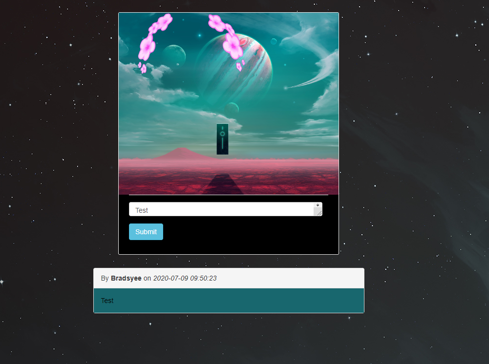

# camagru

This is a Instagram like dublicate for personal use only. View, comment and like posted pictures done in php

Tools Needed

Visual Studio Code is a free and built on open source. Integrated Git, debugging and extensions.
https://code.visualstudio.com/download

XAMPP is a completely free, easy to install Apache distribution containing MariaDB, PHP, and Perl. The XAMPP open source package has been set up to be incredibly easy to install and to use.
https://www.apachefriends.org/index.html

Start the apache and mysql servers 
clone the web application into the xampp htdocs folder and put the url http://localhost/matcha/ into your browser and you good to GO!

Login

Registration

I used MySql for database

Webcam, my pc does not have a awebcam but i got my phone to work like a webcam 

A little bit of Ajax was implemented for getting comments without refreshing page 

